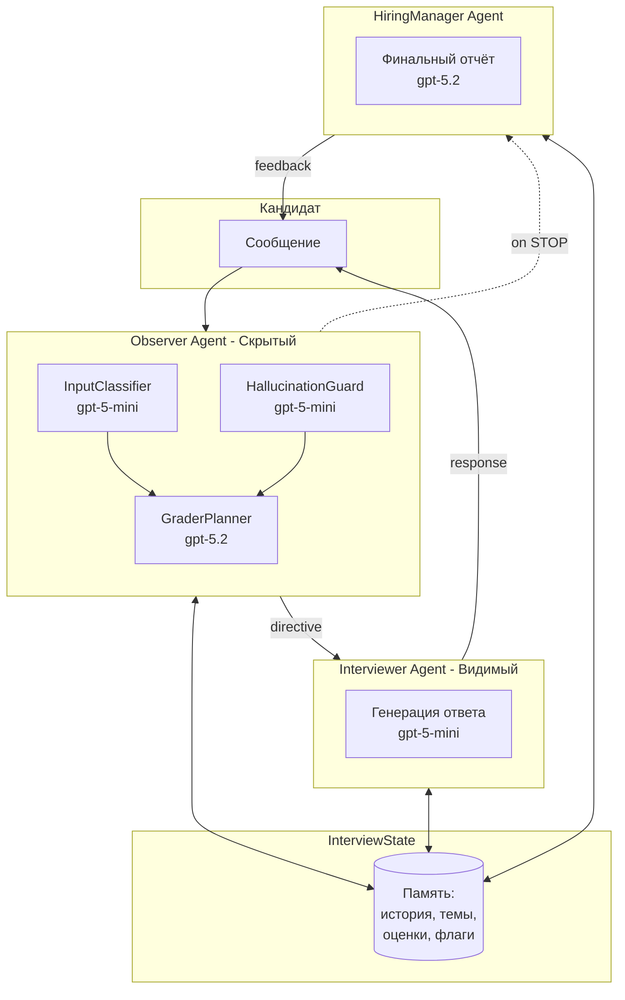

# Multi-Agent Interview Coach

**Мультиагентная система для проведения технических интервью**

Выполнил: Иванов Илья Михайлович

---

## Описание

Система из 3 AI-агентов, которая проводит техническое интервью, имитируя поведение реального рекрутера. Ключевая особенность — агенты «мыслят» перед ответом, и эти размышления логируются для анализа.

Система реализует все требования Agentic Workflow:
- Ролевая специализация (3 агента с разными задачами)
- Скрытая рефлексия (внутренний диалог агентов в логах)
- Сохранение контекста (память о всех ответах кандидата)
- Адаптивность (динамическая сложность вопросов)
- Устойчивость к вбросам (обработка галлюцинаций, off-topic, вопросов кандидата)

---

## Ключевые фичи

| Свойство | Реализация |
|----------|------------|
| **Role Specialization** | 3 агента: Observer (анализ), Interviewer (диалог), HiringManager (отчёт) |
| **Hidden Reflection** | Observer использует 3-шаговый пайплайн, все мысли пишутся в `internal_thoughts` |
| **Context Awareness** | `InterviewState` хранит историю, темы, заданные вопросы, факты о кандидате |
| **Adaptability** | Сложность меняется на основе последних 2 оценок (0.8+ → вверх, 0.4- → вниз) |
| **Robustness** | Детекция галлюцинаций, редирект off-topic, ответы на вопросы кандидата |

---

## Архитектура



### Агенты и их роли

| Агент | Роль | Модель | Видимость |
|-------|------|--------|-----------|
| **Observer** | Анализирует ответы, оценивает, планирует следующий шаг | gpt-5.2 (smart) | Скрытый |
| **Interviewer** | Ведёт диалог, задаёт вопросы, исполняет директивы Observer | gpt-5-mini (fast) | Видимый |
| **HiringManager** | Генерирует структурированный финальный отчёт | gpt-5.2 (smart) | Видимый |

### Observer Pipeline (Hybrid)

Observer использует 3-шаговый пайплайн для структурированного анализа:

```
┌─────────────────────────────────────────────────────────────┐
│                    User Message                              │
└─────────────────────┬───────────────────────────────────────┘
                      │
          ┌───────────┴───────────┐
          │      PARALLEL         │
          ▼                       ▼
┌─────────────────┐     ┌─────────────────┐
│ InputClassifier │     │HallucinationGuard│
│   (gpt-5-mini)  │     │   (gpt-5-mini)   │
│                 │     │                  │
│ • ANSWER        │     │ • Ищет ложные    │
│ • CANDIDATE_Q   │     │   технические    │
│ • OFF_TOPIC     │     │   утверждения    │
│ • STOP          │     │ • Даёт коррекцию │
│ • GREETING      │     │                  │
└────────┬────────┘     └────────┬─────────┘
         │                       │
         └───────────┬───────────┘
                     ▼
          ┌─────────────────┐
          │  GraderPlanner  │
          │   (gpt-5.2)     │
          │                 │
          │ • Оценка 0-1    │
          │ • Soft skills   │
          │ • Next action   │
          │ • Difficulty Δ  │
          │ • Question plan │
          └────────┬────────┘
                   ▼
          ┌─────────────────┐
          │ObserverDirective│
          │   → Interviewer │
          └─────────────────┘
```

---

## Стек технологий

- **Python 3.11+**
- **OpenAI API** (через OpenRouter)
- **Pydantic** — валидация данных и схемы
- **Streamlit** — веб-интерфейс
- **concurrent.futures** — параллельное выполнение шагов Observer

---

## Структура проекта

```
itmo-megaschool/
├── app.py                      # Streamlit UI
├── requirements.txt            # Зависимости
├── .env                        # API ключи (не в git)
├── logs/                       # JSON логи интервью
│   └── interview_log_N.json
│
└── interview_coach/
    ├── __init__.py
    ├── config.py               # LLM клиент, модели
    ├── schemas.py              # Pydantic модели (State, Directive, Turn...)
    ├── graph.py                # InterviewSession — основной workflow
    ├── logger.py               # JSON логгер по формату ТЗ
    ├── main.py                 # CLI запуск
    ├── test_scenario.py        # Тестовые сценарии из ТЗ
    │
    ├── agents/
    │   ├── __init__.py
    │   ├── observer.py         # Observer agent (hybrid pipeline)
    │   ├── observer_steps.py   # InputClassifier, HallucinationGuard, GraderPlanner
    │   ├── interviewer.py      # Interviewer agent
    │   └── hiring_manager.py   # HiringManager agent
    │
    └── topics/
        └── question_bank.py    # Банк вопросов по темам
```

---

## Установка

```bash
# 1. Клонировать репозиторий
git clone <repo-url>
cd itmo-megaschool

# 2. Установить зависимости
pip install -r requirements.txt

# 3. Создать .env файл с API ключом OpenRouter
echo "OPENROUTER_API_KEY=sk-or-v1-your-key-here" > .env
```

## Запуск

### Streamlit UI (рекомендуется)

```bash
streamlit run app.py
```

Откроется веб-интерфейс где можно:
- Ввести данные кандидата (имя, позиция, грейд)
- Вести диалог в чате
- Видеть internal_thoughts в терминале
- Получить финальный отчёт

